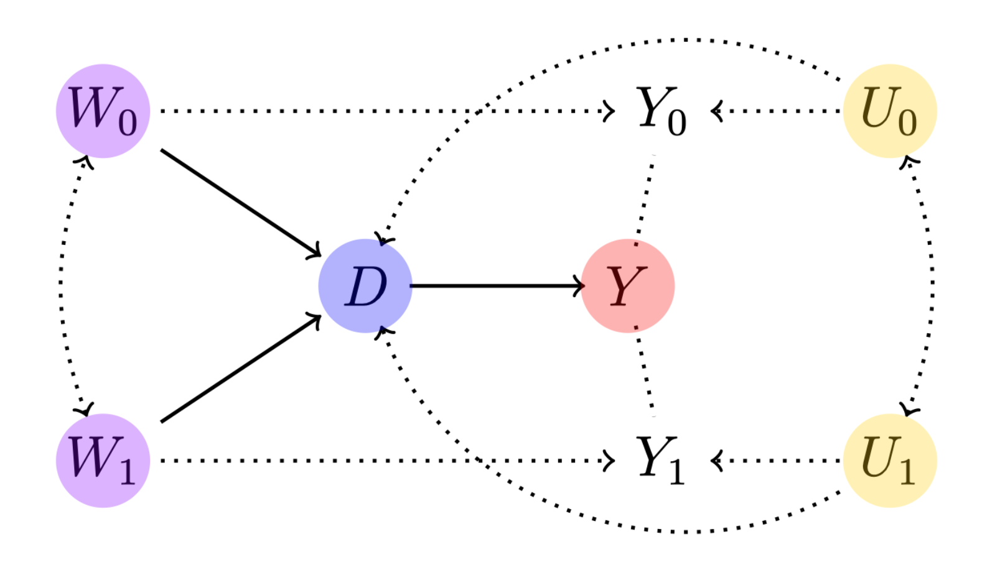

<!-- README.md is generated from README.Rmd. Please edit that file -->

```{r, include = FALSE}
knitr::opts_chunk$set(
  collapse = TRUE,
  #comment = "#>",
  fig.path = "man/figures/README-",
  fig.retina = 2#, 
  #out.width = "100%"
)
```

# semiIVreg: R package for semi-IV regression

<!-- badges: start -->
<!-- badges: end -->

This package provides an implementation of semi-IV regressions as described in [Bruneel-Zupanc (2024)](https://www.cbruneel.com/). 

<div style="text-align: center;">
  
</div>


## Installation

You can find the development version of semiIVreg from [GitHub](https://github.com/cbruneelzupanc/semiIVreg). 
You can download it from there and then install it directly from the local source on your computer: 

```{r install, eval=FALSE} 
# If the package is in a .tar.gz file
install.packages("/path/to/your/package.tar.gz", repos = NULL, type = "source")

# If the package is in a directory
install.packages("/path/to/your/package_directory", repos = NULL, type = "source")
```


Alternatively, you can directly download it from the GitHub repository:
```{r installgit, eval=FALSE}
# install.packages("devtools")
devtools::install_github("cbruneelzupanc/semiIVreg")
```


## Semi-IV Regression

This illustrates what the `semiivreg()`command reports for a semi-IV regression. 
By default, it reports the common support plot of the propensity score and the estimated marginal treatment effects (MTE). 

```{r mte, fig.height=3, dpi=300, out.width = "100%"} 
library(semiIVreg)
data(roydata) # load the data from a simulated Roy model

# semi-IV regression
semiiv = semiivreg(y~d|w0|w1, data=roydata, est_method="sieve") 
```

One can also easily extract a plot for the marginal treatment responses (MTR):
```{r mtr, fig.height=4, fig.width=5, fig.align='center'}
semiiv$plot$mtr
```


For more details, see the detailed documentation for each function and the detailed vignettes.

