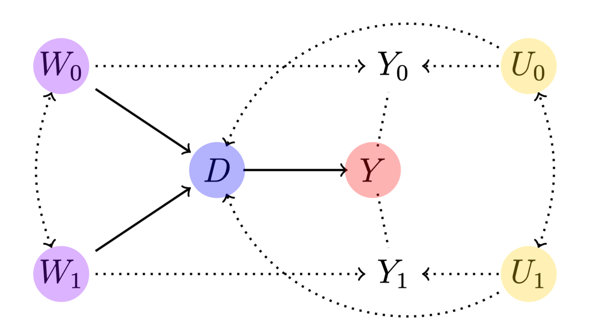

```{r, include = FALSE}
knitr::opts_chunk$set(
  collapse = TRUE,
  comment = "#>", echo = TRUE, fig.retina = 2#,#fig.height=4, fig.width=5, fig.align='center'
)
```


<!--
```{r setup}
library(semiIVreg)
```
--> 


## Overview
<!-- <center>

</center> -->


This package provides estimation procedure with semi-IVs, as in @bruneel2024.  
In particular, the main function `semiivreg()` estimates the marginal treatment effect (MTE) and marginal treatment response (MTR). 

<div style="text-align: center;">
  
</div>

## Installation

The development version of **semiIVreg** is hosted on GitHub [here](https://github.com/cbruneelzupanc/semiIVreg/). It can be conveniently installed via the `install_github()` function from the [remotes](https://CRAN.R-project.org/package=remotes) package.
```{r installation-rforge, eval=FALSE}
remotes::install_github("cbruneelzupanc/semiIVreg")
```


## semi-instrumental variable (semi-IV) regression
## The model

`semiivreg` estimates the marginal treatment effect (MTE) and marginal treatment response (MTR) of the following model.  

The potential outcomes are given by the semi-parametric model:

\[
Y_0 = \delta_{0} + W_0 \beta_0 + X \beta^X_{0} + U_0, \quad \quad \quad (1)
\]

\[
Y_1 = \delta_{1} + W_1 \beta_1 + X \beta^X_{1} + U_1, \quad \quad \quad (2)
\]

with selection rule

\[
\begin{aligned}
D^* &= g(W_0, W_1, X) - V \\
&= - (\alpha + \alpha_0 W_0 + \alpha_1 W_1 + \alpha_{X} X ) - V, \quad \quad \quad (3) \\
\text{ with } \quad D &= \mathbb{I}(D^* > 0),
\end{aligned}
\]

where  

- **semi-IVs**: \(W_0\) (respectively \(W_1\)) are the semi-IVs excluded from \(Y_1\) (resp. \(Y_0\)). Each \(W_0\) and \(W_1\) may contain several variables. Nonparametric identification requires that each \(W_d\) contains *at least one excluded variable* (see @bruneel2024).  

- **Covariates**: \(X\) are the covariates that affect both potential outcomes. By default, different effect of the covariates across alternatives, (i.e., \(\beta^X_{0} \neq \beta^X_{1}\)). To do so, include the covariates separately in both MTR formulas: `semiivreg(y~d|w0+x|w1+x, data)`.
One can restrict the effect of \(X\) to be the same across both potential outcomes (i.e., \(\beta^X_{0} = \beta^X_{1}\)). To do so, specify: `semiivreg(y~d|w0|w1|x, data)`.

- **Unobservables**: \(U_0\) and \(U_1\) are general unobservables (may include several shocks, some may be the same across alternatives) affecting the outcomes. Generally normalize $E(U_d | X, W_d)=0$. \(V\) is a scalar unobservable that affects the selection. The lower \(V\), the more likely one is to select into treatment. Nonparametric identification requires *independence*, i.e., \((U_0, U_1, V) \perp (W_0, W_1) | X\).   
For estimation here, we additionally assume additive *separability* of the covariates \(X\), i.e., that \(E(U_d | V, X) = E(U_d | V)\) for both \(d=0,1\).   
This assumption is *not necessary* for the identification, nor for the estimation. But it is a standard *simplification* that helps the estimation. See @carneiroheckmanvytlacil2011, @brinch2017beyond or @andresen2018exploring for comparable examples of the estimation of MTE with IVs.    


*Remark about the flexibility of the model:* note that \(W_0\) and \(W_1\) can be flexible transformations (polynomial, splines) of specific variables, so the outcome equations are quite flexible (could also specify interactions between \(W_d\) and \(X\)). The semi-parametric model main assumption here is the separability between the unobservables and $X, W_d$, otherwise the model is as general as it can be. 


## Estimation procedure

The estimation procedure closely follows the counterpart estimation of MTE with standard IVs, see for e.g., Andresen (2018). The command estimates **Marginal Treatment Responses** (**MTR**) and **Marginal Treatment Effects** (**MTE**). Define the normalized unobserved resistance to treatment \(U_D = F_V(V) \sim Uniform(0, 1)\). Then, the MTRs are given by:
\[
\begin{aligned}
MTR_d(u, w_d, x) &= E(Y_d | X=x, W_d=w_d, U_D=u) \\
&= \delta_{d} + W_d \beta_d + X \beta^X_{d} + E(U_d|X=x, W_d=w_d, U_D=u) \\
&= \delta_{d} + W_d \beta_d + X \beta^X_{d} + E(U_d|U_D=u) \\
&= \delta_{d} + W_d \beta_d + X \beta^X_{d} + k_d(u),
\end{aligned}
\]
where the last equalities comes from the fact that $E(U_d|X=x, W_d=w_d, U_D=u) = E(U_d|U_D=u)$ by the separability and independence, and then we just define $k_d(u) = E(U_d|U_D=u)$.


Then, the Marginal Treatment Effects (MTE) are given by
\[
\begin{aligned}
MTE(u, x, w_0, w_1) &= E(Y_1 - Y_0 | X = x, W_0=w_0, W_1=w_1, U_D=u) \\
&= MTR_1(u, w_1, x) - MTR_0(u, w_0, x).
\end{aligned}
\]


Remark: the MTR and MTE are estimated at given covariates and semi-IVs, $(X, W_0, W_1)$. This is specified using `ref_indiv`. Or by default, it computes the 'average individual' (and take reference level for factor).    

The estimation proceeds in two stages: first estimate the propensity to be treated, $P$, and then the potential outcome treatment parameters.   


### 1st stage: propensity score
Estimate the propensity score \(\widehat{P}\) of treatment selection of equation (3).  
By default, the function \(g(\cdot)\) is given by the simple linear specification above, but the code allows specifying any other first stage. For example:

```r
  semiivreg(y~d|w0+x|w1+x, data,
            propensity_formula = d~w0+w1+w0:w1+w0:x+w1:x+I(w0^2)+I(w1^2))
```

By default, the estimation assumes a *probit model* for the first stage (i.e., assumes \(V\) is normally distributed). However, you can specify other models (e.g., logit) using the `firststage_model` argument. In theory, any specification for the first stage could be added, and it is even possible to estimate the propensity score outside of the `semiivreg` command (this feature is not implemented yet).  <br><br>    


### 2nd stage: marginal treatment responses
#### Estimated objects

First, given estimated $\widehat{P}$, the second stage estimates the following semi-parametric **partially linear model** for the potential outcomes 
\[
\begin{aligned}
E[Y|D=0, W_0, X, \widehat{P}] &= \delta_{0} + W_0 \beta_0 + X \beta^X_{0} + \kappa_0(\widehat{P}), \\
E[Y|D=0, W_1, X, \widehat{P}] &= \delta_{1} + W_1 \beta_1 + X \beta^X_{1} + \kappa_1(\widehat{P}), 
\end{aligned}
\]
where $\kappa_d(P)$ are **control functions**, equal to
\[
\begin{aligned}
\kappa_1(P) &= E[ U_1 | D=1, W_1, W_0, X,P] = E[U_1|D=1, P] = E[U_1 | U_D \leq P] \\
\kappa_0(P) &= E[ U_0 | D=0, W_1, W_0, X,P] = E[U_0|D=0, P] = E[U_0 | U_D > P].
\end{aligned}
\]
It is a *partially linear model* because the control functions are nonparametric and can be estimated more or less flexibly (see below). 

Once the parameters $\delta_d, \beta_d, \beta^X_d$ and the flexible control function $\kappa_d()$ are estimated, we don't need to estimate any other parameters to obtain the MTE and MTR. We only need to also obtain the derivative from the estimated $\kappa_d$. Indeed, define
\[
\begin{aligned}
\widehat{k}_1(u) &= E[ U_1 | U_D=u] = \widehat{\kappa}_1(u) + u \widehat{\kappa}_1'(u), \\
\widehat{k}_0(u) &= E[ U_0 | U_D=u] = \widehat{\kappa}_0(u) - (1-u) \widehat{\kappa}_0'(u).
\end{aligned}
\]

Then, the *Marginal Treatment Responses* are given by:
\[
\begin{aligned}
\widehat{MTR}_d(u, w_d, x) &= E(Y_d | X=x, W_d=w_d, U_D=u) = \widehat{\delta}_{d} + w_d \widehat{\beta}_d + x \widehat{\beta}^X_{d} + \widehat{k}_d(u)
\end{aligned}
\]

and the *Marginal Treatment Effects* are:
\[
\begin{aligned}
\widehat{MTE}(u, x, w_0, w_1) = \widehat{MTR}_1(u, w_1, x) - \widehat{MTR}_0(u, w_0, x).
\end{aligned}
\]

Consequently, the estimation is about estimating the parameters and $\kappa_d$. Several estimation method `est_method` are implemented in `semiivreg()`. We describe them below.   <br><br>


#### Method 1. Double residual regression, Robinson (1988)

The default method, implemented with `est_method="locpoly"` is to run a *double residual regression*, à la @robinson1988root, in order to estimate the *partially linear model*. We implement it similarly to the separate approach of @andresen2018exploring for the estimation of MTE with IVs. We estimate using a *separate approach*, i.e., estimate separately on the treated and untreated samples, by implementing the following steps:

-  **Step 1.** Estimate $E(Y_d | D=d, \widehat{P})$, $E(W_d | D=d, \widehat{P})$ and $E(X | D=d, \widehat{P})$ with a nonparametric local polynomial regression. 
To specify the bandwidth of the local polynomial regression, use `bw0` or `bw1`. If not specified, the bandwidth are automatically computed using the method of `bw_method`. The default being a fast `"plug-in"` method from the library `KernSmooth`. We can also specify the degree of the polynomial with `pol_degree_locpoly1`. By default, equal to $1$ as recommended in @fangijbels2003 (order of the function we target $+1$).


- **Step 2.** On each subsample, compute the residuals $e_{Y_d} = Y_d - E(Y_d | D=d, \widehat{P})$, $e_{W_d} = W_d - E(W_d | D=d, \widehat{P})$ and $e_X^d = X - E(X | D=d, \widehat{P})$. Then, run the first residual regression, with a **no-intercept OLS**:  
\[ e_{Y_d} = e_{W_d} \beta_d + e_X^d \beta^X_d + \tilde{U}_d. \]         
This regression on the subsample with $D=d$, provides consistent estimates of $\beta_d$ and $\beta^X_d$.   
Indeed, the residual equation is equivalent to  
\[ Y_d - E[Y_d | D=d, \widehat{P}] = (W_d - E[W_d | D=d, \widehat{P}]) \beta_d + E(X - E[X | D=d, \widehat{P}]) \beta_d^X + (U_d - E[U_d | D=d, \widehat{P}]). \]
and if we denote $\tilde{U}_d = U_d - E[U_d | D=d, \widehat{P}]$, we have $E[\tilde{U}_d | D=d,  \widehat{P}] = 0$, so the no-intercept residual OLS regression gives consistent estimates.   


- **Step 3.** Construct $\tilde{Y}_d = Y - W_d \widehat{\beta_d} - X \widehat{\beta^X_d}$, on the sample with $D=d$, i.e., the outcome `net of the effect` of the covariates. We have 
\[\tilde{Y}_d = \delta_d + U_d := \tilde{\kappa}_d(P). \]


- **Step 4.** Estimate $\tilde{\kappa}_d(P)$ using a second nonparametric local polynomial regression of $\tilde{Y}_d$ on $P$. 
To specify the bandwidth of the local polynomial regression, use `bw_y0` or `bw_y1`. If not specified, the bandwidth are automatically computed using the method of `bw_method`. The default being a fast `"plug-in"` method from the library `KernSmooth`. We can also specify the degree of the polynomial with `pol_degree_locpoly2`. By default, equal to $2$ as recommended in @fangijbels2003 because we want to estimate the derivative, $\tilde{k}_d(u) = E[\delta_d + U_d|U_D=u]$. \\
Once we have $\tilde{\kappa}_d$, we can compute 
\[
\begin{aligned}
\widehat{\tilde{k}}_1(u) &= E[ \delta_1 + U_1 | U_D=u] = \widehat{\tilde{\kappa}}_1(u) + u \widehat{\tilde{\kappa}}_1'(u), \\
\widehat{\tilde{k}}_0(u) &= E[ \delta_0 + U_0 | U_D=u] = \widehat{\tilde{\kappa}}_0(u) - (1-u) \widehat{\tilde{\kappa}}_0'(u).
\end{aligned}
\]

Using the $\widehat{\tilde{k}}_d(u)$ and the estimated \widehat{\beta}_d, \widehat{\beta}^X_d, we can compute the MTR on this subsample $D=d$, as 
\[
\begin{aligned}
\widehat{MTR}_d(u, w_d, x) &= E(Y_d | X=x, W_d=w_d, U_D=u) = w_d \widehat{\beta}_d + x \widehat{\beta}^X_{d} + \widehat{\tilde{k}}_d(u).
\end{aligned}
\]   
Remark that the definition of $\tilde{\kappa}_d(P)$, is equivalent to defining a more general shock that would include a constant, $\tilde{U}_d = \delta_d + U_d$. This is innoccuous and yield the same MTR/MTE in the end. 


Once the MTR are estimated separately on both subsample, we can estimate the MTE:
\[
\begin{aligned}
\widehat{MTR}_d(u, w_d, x) &= E(Y_d | X=x, W_d=w_d, U_D=u) = w_d \widehat{\beta}_d + x \widehat{\beta}^X_{d} + \widehat{\tilde{k}}_d(u) \\
\widehat{MTE}(u, x, w_0, w_1) &= \widehat{MTR}_1(u, w_1, x) - \widehat{MTR}_0(u, w_0, x).
\end{aligned}
\]   


*Advantages.* The main advantage of this double residual regression is that it is robust to misspecification of the nonparametric $\kappa_d$ function, see @robinson1988root. However, it still requires to specify the bandwidths. 
In order to obtain the standard errors around the estimates, given that $P$ is estimated in a first stage, we bootstrap the standard errors using `semiivreg_boot()`. This function takes longer than the default estimation which is almost instantaneous. <br><br>


#### Method 2. Sieve estimation

An alternative method is to use sieve approach, implemented with `est_method="sieve"`, to estimate the second stage. 
The idea is simply to specify the control function $\kappa_d$ as a flexible function of $P$, using flexible functional form.   

By default we use polynomial transformation of degree `pol_degree_sieve=5` for $\kappa_0(P)$ and $\kappa_1(P)$. Then, we estimate the second stage using a stacked regression of the form:
\[
\begin{aligned}
E[Y|W_0, W_1, X, \widehat{P}] = &D \times ( \delta_{1} + W_1 \beta_1 + X \beta^X_{1} + \kappa_1(\widehat{P}) ) + \\
&(1-D) \times ( \delta_{0} + W_0 \beta_0 + X \beta^X_{0} + \kappa_0(\widehat{P})).
\end{aligned}
\]
We do it as a stacked regression and not separately in order to allow to restrict some covariates to have the same effect on both potential outcomes (e.g., $\beta_0^X = \beta_1^X$). 

Once we obtain $\widehat{\kappa}_d(P)$, we proceed as before to obtain $k_d(u)$ and the MTR/MTE. Because of the polynomial functional form, $k_d(u)$ has a known functional form based on the estimated coefficients for $\kappa_d$, so it is very easy to compute. 


*Advantages.* The main advantage of this sieve approach is that it is faster and easier to implement (but `"locpoly"` is also fast anyway). It also provides analytical standard errors. These are wrong because they do not take into account that $\widehat{P}$ is estimated in a first stage, but, if $\widehat{P}$ is well estimated, the analytical standard errors should be very close to the true one that we can obtain with the bootstrap in `semiivreg_boot()`.  
The disadvantage is that it is less robust to misspecification of the control function as a polynomial. Even though, as visible in this [vignette](https://cbruneelzupanc.github.io/semiIVreg/articles/semiIVreg_heterogenousTE.html), it still works well in our examples, even if the underlying $\kappa_d$ is not a polynomial.  <br><br>


#### Method 3. Special Case with Homogenous Treatment Effects

Using `est_method="homogenous"`, `semiivreg()` can also estimate a restricted model where we assume that the treatment effects are **homogenous**, i.e., the $MTE(u, x, w_0, w_1) = MTE(x, w_0, w_1)$, only varies with the observable covariates, but is constant with respect to $U_D$. The homogenous treatment effect assumption is equivalent to imposing that the underlying model corresponds to the general potential outcome model (1)-(2), with the additional restriction that \(U_0 = U_1 = U\). 

It is estimated using a procedure similar to the `sieve` approach with heterogenous treatment effects, but where we impose additional known restriction on the control functions \(\kappa_0(P)\) and \(\kappa_1(P)\) in the second stage estimation. Indeed,
\[
E(U) = 0 = E(U | U_D \leq P) P + E(U | U_D > P) (1-P)
\]

So, \(\kappa_0(P) = -\kappa_1(P) \frac{P}{1-P}\), and one can check that it yields \(k_0(u) = k_1(u) = k(u)\).

Thus, the MTE is constant (\(k_1(u) - k_0(u) = 0\), it cancels out), and equal to:

\[
\widehat{MTE}(x, w_0, w_1) = \widehat{\delta}_{1} - \widehat{\delta}_{0} + w_1 \widehat{\beta}_1 - w_0 \widehat{\beta}_0 + x (\widehat{\beta}^X_{1} - \widehat{\beta}^X_{0}).
\]

Note that the MTR still varies with \(u\) because \(k(u)\) is not constant, only the MTE is.    <br><br>


#### Caution about the Estimated Standard Errors


By default, `est_method="sieve"` and `"homogenous`" return *analytic standard errors*... But not accounting for the fact that the propensity score is estimated in a first stage in `semiivreg`. Thus, these are wrong (but the bias is very small if the first stage is well estimated, see  [these simulations](https://cbruneelzupanc.github.io/semiIVreg/articles/semiIVreg_homogenousTE.html) for example).  
Use `semiivreg_boot` to obtain 'correct' bootstrapped confidence intervals. <br><br>


## Illustration with simulated Roy model

This illustrates what the `semiivreg()`command reports for a semi-IV regression. 
By default, it reports the common support plot of the propensity score and the estimated marginal treatment effects (MTE). 

```{r mte, fig.height=3, fig.width=7, fig.align='center'} 
library(semiIVreg)
data(roydata) # load the data from a simulated Roy model

# semi-IV regression
semiiv = semiivreg(y~d|w0|w1, data=roydata) 
```

One can also easily extract a plot for the marginal treatment responses (MTR):
```{r mtr, fig.height=4, fig.width=5, fig.align='center'}
semiiv$plot$mtr
```


For more details, see the vignettes on estimation with [heterogenous](https://cbruneelzupanc.github.io/semiIVreg/articles/semiIVreg_heterogenousTE.html) or [homogenous](https://cbruneelzupanc.github.io/semiIVreg/articles/semiIVreg_homogenousTE.html) treatment effects. Refer also to @bruneel2024. 


## References


